# CAA System Architecture

## Data-flow diagram

```mermaid
flowchart TB
  subgraph Capture["Capture Layer (Browser)"]
    GUM[getUserMedia video+audio]
    CH[Channel detector ≥4?]
    MR[MediaRecorder optional record]
    DEV[Device picker / permissions]
    GUM --> CH
    DEV --> GUM
  end

  subgraph ModeA["Mode A — Full"]
    DOA[GCC-PHAT DOA Worker]
    BEAM[Zone angle bins]
    CH -->|≥4 ch| DOA --> BEAM
  end

  subgraph ModeB["Mode B — Degraded"]
    ENV[Room RMS envelope]
    CH -->|<4 ch| ENV
  end

  subgraph Vision["Vision Worker — on-device"]
    ADP[Vision Adapter]
    DET[Person boxes]
    FLOW[Optical flow energy]
    ADP --> DET --> FLOW
  end

  subgraph Fusion["Fusion Engine"]
    BASE[EWMA baseline ≥60s / zone]
    PERS[Persistence counter ≥N windows]
    FUSE["score = f(Δaudio, motion, persistence)"]
    OUT["{zone_id, activity, confidence, ts}"]
    BEAM --> BASE
    FLOW --> BASE
    BASE --> PERS --> FUSE --> OUT
  end

  subgraph UI["Teacher UI"]
    ZMAP[Zone map — position + glyph]
    KILL[Kill switch]
    DISM[Dismiss — anonymous tuple]
    OUT -->|confidence≥0.6| ZMAP
    OUT -->|confidence<0.6| SILENT[Silent — log tune only]
  end

  subgraph Upload["Upload Path — retrospective only"]
    FILE[File validate]
    TUS[Chunked upload]
    BATCH[Server batch analysis]
    CONSENT[Consent artifact required]
    FILE --> CONSENT --> TUS --> BATCH
  end

  GUM --> Vision
  ENV --> UI
  MR -.->|local only| FILE

  style SILENT fill:#333,stroke:#666
  style CONSENT fill:#2a4,stroke:#484
```

## Component boundaries

| Layer | Responsibility | Egress |
|-------|----------------|--------|
| Capture | Permissions, devices, record, upload, cleanup | Upload path only (with consent) |
| DOA Worker | GCC-PHAT per window | None |
| Vision Worker | Adapter contract, frame dispose | None |
| Fusion | Baseline, persistence, confidence gate | Optional zone tuples if analytics opt-in |
| UI | PEOS states, kill switch, dismiss | Dismiss tuple only |

## Latency budget (engineering targets — **not measured**)

| Stage | Target share of 500ms p95 |
|-------|---------------------------|
| Audio frame + DOA | ≤150ms |
| Vision infer @5fps | ≤200ms (amortized) |
| Fusion + UI | ≤50ms |
| Buffer | remainder |

**Fact**: Actual p95 must be profiled on reference hardware before release.
